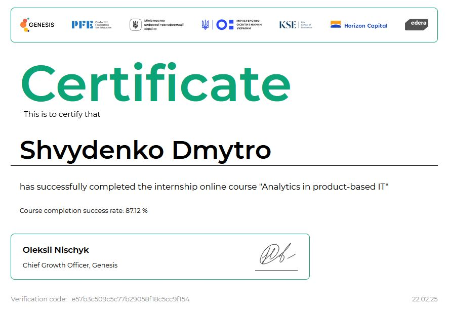

# Dmitry Shvydenko

Devops engineer

<div style="display: flex; justify-content: center; align-items: center; gap: 10px;">
    
    
    
    
    
    
</div>

```python
class DevOpsEngineer:
    def __init__(self, name):
        self.name = name

    def work(self):
        return f"{self.name} automates everything!"  # [!code focus]

me = DevOpsEngineer("Dmitry Shvydenko")
print(me.work())
```
## Education

| Years      | Degree                  | Field                |
|------------|-------------------------|----------------------|
| 2023-2025 | Master                  | Computer Science    |
| 2021-2023 | Bachelor                | Systems Analysis    |
| 2017-2021 | Secondary-specialized   | Computer Science    |


## Skills

| Category        | Technologies                           |
|----------------|--------------------------------------|
| DevOps         | Git, CI/CD, Terraform, Ansible      |
| Containerization | Docker, Kubernetes (K8s)          |
| Databases      | RDB (PostgreSQL, MySQL)            |
| Cloud          | AWS, GCP, Azure                     |
| Monitoring     | Prometheus, Grafana, Zabbix        |
| OS            | Linux                                |
| Languages      | Python, Bash, C/C++                |

## Certificate



## CV

<a href="./img/index/cv_en.pdf" download>English</a>

<a href="./img/index/cv_uk.pdf" download>Ukraine</a>
